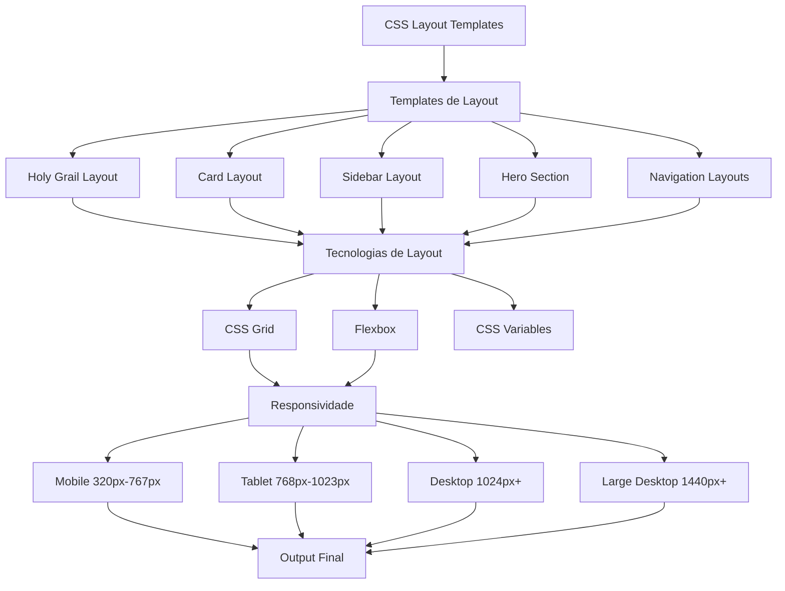
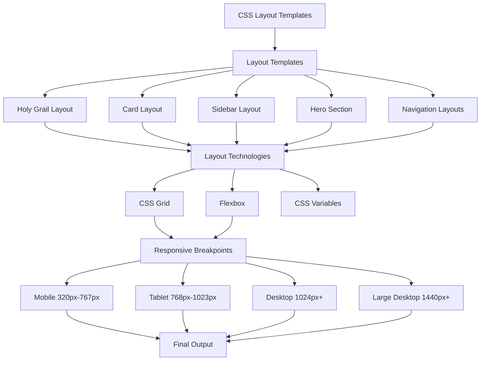

# CSS Layout Templates


Coleção de templates de layout responsivos implementados com CSS moderno, incluindo Flexbox, CSS Grid e técnicas avançadas de posicionamento para criar interfaces web profissionais.

## 🎯 Demonstração

Este projeto oferece uma base sólida para implementação de layouts responsivos usando as melhores práticas de CSS moderno. Abra o `index.html` para ver todos os layouts em ação!

## ✨ Características

- **Layouts Responsivos**: Adaptáveis a diferentes dispositivos
- **CSS Grid & Flexbox**: Técnicas modernas de layout
- **Mobile-First**: Abordagem responsiva otimizada
- **Cross-Browser**: Compatibilidade ampla
- **Semântico**: HTML estruturado e acessível
- **Exemplos Práticos**: Templates prontos para uso

## 🛠️ Tecnologias

- **HTML5**: Estrutura semântica moderna
- **CSS3**: Grid, Flexbox, Media Queries
- **CSS Variables**: Sistema de design consistente

## 🏗️ Sistema de Layouts / Layout System



## 📁 Estrutura do Projeto

```
CSS-Layout-Templates/
├── index.html          # Página principal com demonstrações
├── styles.css          # Todos os estilos e layouts responsivos
├── examples/           # Templates de exemplo
│   └── holy-grail.html # Exemplo do layout Holy Grail
├── README.md           # Esta documentação
├── LICENSE             # Licença MIT
└── .gitignore          # Arquivos ignorados pelo Git
```

## 🚀 Como Usar

### Instalação

1. Clone o repositório:

```bash
git clone https://github.com/galafis/CSS-Layout-Templates.git
cd CSS-Layout-Templates
```

2. Abra o arquivo `index.html` no navegador ou use um servidor local:

```bash
# Usando Python
python -m http.server 8000

# Usando Node.js
npx serve .
```

3. Acesse `http://localhost:8000` e explore os layouts!

### Usando em Seus Projetos

Basta copiar as classes CSS do `styles.css` ou usar o arquivo completo:

```html
<link rel="stylesheet" href="styles.css">
```

## 📋 Tipos de Layout Disponíveis

### 1. Layout com CSS Grid

Grid responsivo com auto-ajuste de colunas:

```css
.grid-container {
    display: grid;
    grid-template-columns: repeat(auto-fit, minmax(300px, 1fr));
    gap: 20px;
    padding: 20px;
}
```

**Uso:**
```html
<div class="grid-container">
    <div class="card">Item 1</div>
    <div class="card">Item 2</div>
    <div class="card">Item 3</div>
</div>
```

### 2. Layout Flexbox

Sistema flexível para alinhamento e distribuição:

```css
.flex-container {
    display: flex;
    flex-wrap: wrap;
    justify-content: space-between;
    align-items: center;
    gap: 20px;
}
```

### 3. Layout Responsivo com Media Queries

Abordagem mobile-first com breakpoints bem definidos:

```css
/* Mobile First */
.container {
    width: 100%;
    padding: 10px;
}

/* Tablet: 768px - 1023px */
@media (min-width: 768px) {
    .container {
        max-width: 750px;
        margin: 0 auto;
    }
}

/* Desktop: 1024px+ */
@media (min-width: 1024px) {
    .container {
        max-width: 1200px;
    }
}
```

## 📐 Padrões de Layout Suportados

Todos estes layouts estão totalmente implementados e prontos para uso:

- **Holy Grail Layout**: Header, footer, sidebar e conteúdo principal (veja `examples/holy-grail.html`)
- **Card Layout**: Grid de cards responsivos com efeitos hover
- **Sidebar Layout**: Layout com barra lateral fixável ou colapsável
- **Hero Section**: Seções de destaque com call-to-action
- **Navigation Layouts**: Menus responsivos e navegação adaptativos

## 🎨 Personalização

Modifique as variáveis CSS no início do `styles.css` para personalizar o design:

```css
:root {
    --primary-color: #667eea;
    --secondary-color: #764ba2;
    --container-max-width: 1200px;
    --grid-gap: 20px;
    --border-radius: 8px;
}
```

Algumas personalizações comuns:

```css
/* Tema escuro */
:root {
    --primary-color: #4F46E5;
    --secondary-color: #7C3AED;
}

/* Espaçamento maior */
:root {
    --grid-gap: 30px;
}

/* Bordas mais arredondadas */
:root {
    --border-radius: 12px;
}
```

## 📱 Breakpoints Responsivos

Todos os layouts respondem automaticamente aos seguintes breakpoints:

```css
/* Mobile: 320px - 767px */
/* Tablet: 768px - 1023px */
/* Desktop: 1024px+ */
/* Large Desktop: 1440px+ */
```

## 📚 Exemplos Práticos

O diretório `examples/` contém templates prontos para uso:

- **holy-grail.html**: Implementação completa do layout Holy Grail com documentação inline

Você pode copiar e adaptar estes exemplos para seus próprios projetos.

## 🤝 Contribuindo

Contribuições são muito bem-vindas! Para adicionar novos templates ou melhorar os existentes:

1. Fork o projeto
2. Crie uma branch para sua feature (`git checkout -b feature/NovoTemplate`)
3. Commit suas mudanças (`git commit -m 'Adiciona novo template de layout'`)
4. Push para a branch (`git push origin feature/NovoTemplate`)
5. Abra um Pull Request

**Ideias para contribuição:**
- Novos templates de exemplo no diretório `examples/`
- Variações de layout existentes
- Melhorias de acessibilidade
- Otimizações de performance
- Documentação e tutoriais

## 📝 Recursos Adicionais

- [CSS Grid Layout Guide](https://css-tricks.com/snippets/css/complete-guide-grid/)
- [Flexbox Guide](https://css-tricks.com/snippets/css/a-guide-to-flexbox/)
- [Responsive Web Design Basics](https://web.dev/responsive-web-design-basics/)

## 📄 Licença

Este projeto está licenciado sob a Licença MIT - veja o arquivo [LICENSE](LICENSE) para detalhes.

## 👨‍💻 Autor

**Gabriel Demetrios Lafis**

- GitHub: [@galafis](https://github.com/galafis)
- Email: gabrieldemetrios@gmail.com

---

⭐ Se este projeto foi útil para você, considere deixar uma estrela! Isso me ajuda a saber que o trabalho está sendo valorizado e me motiva a continuar melhorando o projeto.

---

# CSS Layout Templates — English

Collection of responsive layout templates implemented with modern CSS, including Flexbox, CSS Grid, and advanced positioning techniques for building professional web interfaces.

## 🎯 Demo

This project provides a solid foundation for implementing responsive layouts using modern CSS best practices. Open `index.html` to see all layouts in action!

## ✨ Features

- **Responsive Layouts**: Adaptable to different devices
- **CSS Grid & Flexbox**: Modern layout techniques
- **Mobile-First**: Optimized responsive approach
- **Cross-Browser**: Wide compatibility
- **Semantic**: Structured and accessible HTML
- **Practical Examples**: Ready-to-use templates

## 🏗️ Layout System



## 🚀 Quick Start

1. Clone the repository:

```bash
git clone https://github.com/galafis/CSS-Layout-Templates.git
cd CSS-Layout-Templates
```

2. Open `index.html` in your browser or use a local server:

```bash
python -m http.server 8000
```

3. Visit `http://localhost:8000` and explore the layouts!

## 📐 Supported Layout Patterns

- **Holy Grail Layout**: Header, footer, sidebar, and main content
- **Card Layout**: Responsive card grid with hover effects
- **Sidebar Layout**: Layout with fixed or collapsible sidebar
- **Hero Section**: Featured sections with call-to-action
- **Navigation Layouts**: Responsive menus and adaptive navigation

## 📄 License

This project is licensed under the MIT License — see the [LICENSE](LICENSE) file for details.

## 👨‍💻 Author

**Gabriel Demetrios Lafis**

- GitHub: [@galafis](https://github.com/galafis)
- Email: gabrieldemetrios@gmail.com

---

⭐ If this project was helpful, consider leaving a star!
