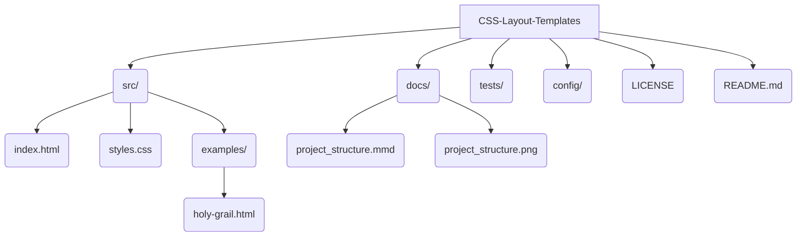

# CSS Layout Templates


A collection of responsive layout templates implemented with modern CSS, including Flexbox, CSS Grid, and advanced positioning techniques to create professional web interfaces.

## 🎯 Demo

This project provides a solid foundation for implementing responsive layouts using modern CSS best practices. Open `src/index.html` to see all layouts in action!

## ✨ Features

- **Responsive Layouts**: Adaptable to different devices
- **CSS Grid & Flexbox**: Modern layout techniques
- **Mobile-First**: Optimized responsive approach
- **Cross-Browser**: Broad compatibility
- **Semantic**: Structured and accessible HTML
- **Practical Examples**: Ready-to-use templates

## 🛠️ Technologies

- **HTML5**: Modern semantic structure
- **CSS3**: Grid, Flexbox, Media Queries
- **CSS Variables**: Consistent design system

## 📁 Project Structure



For a visual representation of the diagram, see [project_structure.png](docs/project_structure.png).

## 🚀 How to Use

### Installation

1. Clone the repository:

```bash
git clone https://github.com/galafis/CSS-Layout-Templates.git
cd CSS-Layout-Templates
```

2. Open the `src/index.html` file in your browser or use a local server:

```bash
# Usando Python
python -m http.server 8000

# Usando Node.js
npx serve .
```

3. Access `http://localhost:8000` and explore the layouts!

### Using in Your Projects

Simply copy the CSS classes from `src/styles.css` or use the complete file:

```html
<link rel="stylesheet" href="src/styles.css">
```

## 📋 Available Layout Types

### 1. CSS Grid Layout

Responsive grid with auto-adjusting columns:

```css
.grid-container {
    display: grid;
    grid-template-columns: repeat(auto-fit, minmax(300px, 1fr));
    gap: 20px;
    padding: 20px;
}
```

**Usage:**
```html
<div class="grid-container">
    <div class="card">Item 1</div>
    <div class="card">Item 2</div>
    <div class="card">Item 3</div>
</div>
```

### 2. Flexbox Layout

Flexible system for alignment and distribution:

```css
.flex-container {
    display: flex;
    flex-wrap: wrap;
    justify-content: space-between;
    align-items: center;
    gap: 20px;
}
```

### 3. Responsive Layout with Media Queries

Mobile-first approach with well-defined breakpoints:

```css
/* Mobile First */
.container {
    width: 100%;
    padding: 10px;
}

/* Tablet: 768px - 1023px */
@media (min-width: 768px) {
    .container {
        max-width: 750px;
        margin: 0 auto;
    }
}

/* Desktop: 1024px+ */
@media (min-width: 1024px) {
    .container {
        max-width: 1200px;
    }
}
```

## 📐 Supported Layout Patterns

All these layouts are fully implemented and ready to use:

- **Holy Grail Layout**: Header, footer, sidebar, and main content (see `src/examples/holy-grail.html`)
- **Card Layout**: Responsive card grid with hover effects
- **Sidebar Layout**: Layout with a fixed or collapsible sidebar
- **Hero Section**: Sections of highlight with call-to-action
- **Navigation Layouts**: Responsive and adaptive menus

## 🎨 Customization

Modify the CSS variables at the beginning of `src/styles.css` to customize the design:

```css
:root {
    --primary-color: #667eea;
    --secondary-color: #764ba2;
    --container-max-width: 1200px;
    --grid-gap: 20px;
    --border-radius: 8px;
}
```

Some common customizations:

```css
/* Dark theme */
:root {
    --primary-color: #4F46E5;
    --secondary-color: #7C3AED;
}

/* Larger spacing */
:root {
    --grid-gap: 30px;
}

/* More rounded borders */
:root {
    --border-radius: 12px;
}
```

## 📱 Responsive Breakpoints

All layouts automatically respond to the following breakpoints:

```css
/* Mobile: 320px - 767px */
/* Tablet: 768px - 1023px */
/* Desktop: 1024px+ */
/* Large Desktop: 1440px+ */
```

## 📚 Practical Examples

The `src/examples/` directory contains ready-to-use templates:

- **holy-grail.html**: Complete implementation of the Holy Grail layout with inline documentation

You can copy and adapt these examples for your own projects.

## 🤝 Contributing

Contributions are very welcome! To add new templates or improve existing ones:

1. Fork the project
2. Create a new branch for your feature (`git checkout -b feature/NewTemplate`)
3. Commit your changes (`git commit -m 'Adds new layout template'`)
4. Push to the branch (`git push origin feature/NewTemplate`)
5. Open a Pull Request

**Ideas for contribution:**

- New example templates in the `src/examples/` directory
- Variations of existing layouts
- Accessibility improvements
- Performance optimizations
- Documentation and tutorials

## 📝 Additional Resources

- [CSS Grid Layout Guide](https://css-tricks.com/snippets/css/complete-guide-grid/)
- [Flexbox Guide](https://css-tricks.com/snippets/css/a-guide-to-flexbox/)
- [Responsive Web Design Basics](https://web.dev/responsive-web-design-basics/)

## 📄 License

This project is licensed under the MIT License - see the [LICENSE](LICENSE) file for details.

## 👨‍💻 Author

**Gabriel Demetrios Lafis**

- GitHub: [@galafis](https://github.com/galafis)
- Email: gabrieldemetrios@gmail.com

---

⭐ If this project was helpful to you, consider leaving a star! This helps me know that the work is being valued and motivates me to continue improving the project.

